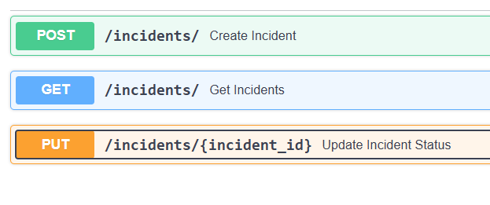

## ⚙️ Установка и запуск

### 1. Клонируйте репозиторий
```bash
git clone https://github.com/dan-tes/TestTask3.git
cd TestTask3
docker compose up --build
```
## Документация
### 3 Endpoints с функционалом по тз

